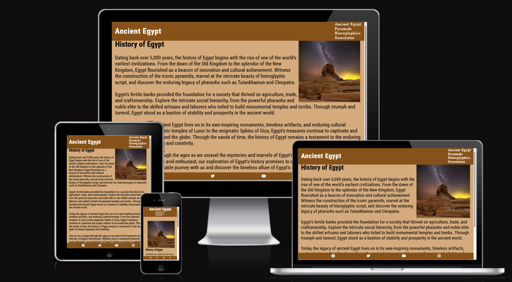

ANCIENT EGYPT

The Ancient Egypt website is a landing page for avid historians of any age who are looking for information on Ancient Egypt, hieroglyphics and the pyramids.

Users of this website will find out all they need to know about Ancient Egypt, Pyramids and Hieroglyphics as they make their journey through the website. The site is targeted towards anyone who has an interest in Ancient Egypt and it's many wonders. 

### Website Responsiveness

FEATURES

Navigation bar

At the top of the page sits the navigation bar. The navigation bar shows the name of the website in the top left corner.
On the right hand side of the navgiation bar there are links: Ancient Egypt, Pyramids, Hieroglyphics, Newsletter. These links take you to relevant pages in the website.
The navigation bar font is colored in a way to contrast with the background. The navigation bar also aids the user by giving the user easy access to the other parts of the website.

![Image of the websites header/navigation bar]{docs/navigation-bar.PNG}

Ancient Egypt

The Ancient Egypt page briefly describes egypts past it also sets the theme for the website as you can see
the font and color themes throughout the website are based from the intial landing page. Along with the fixed
navigation and footer features which remain the same throughout each page.
The page also describes who the website is for 'seasoned historian or an avid enthusiast'

![Image of the websites landing page (index.html)]{docs/landing-page.PNG}

Pyramids

The Pyramids page gives an in-depth description regarding the pyramids of Giza
This page also adheres to the theme throughout the website with accompanying image of the pyramids.

--------------------------------------------------------------------------------------------
This website is aimed at people who love Ancient Egypt. 

Header will hold a logo (ideally a Pharoahs head) along with a nav bar for the user to quickly
navgiate between the 3 sections.

Div 1 will be about Ancient Egypt a brief history of their timeline
Div 2 will be about the pyramids, pharoahs and heiroglyphics
Div 3 will be for the newsletter form where people can sign up to a 'monthly' newsletter for facts bout ancient egypt.

Footer will hold the social media links for said website. 

BUGS

Debugged an issue which I created when adding the google-fonts to my css. 
I had fogotten to add a ';' to the end of the input resulting in all my css styling 
to become ignored by the PC.

Debugged another issue when creating responsiveness with my website. I had issues with white-
space inbetween the header and the main content due to a margin I had placed in to fix a previous issue. Reducing the size of the margin-top removed this issue.

When creating responsivness for tablet size devices I ran into a bug with my index.html page. A white space had been created between the header and the content section. Due to time-constraints I came up with a quick fix of adding a 'margin-top: -10px;' to the intro section and added a comment to the part in the css.

### REFERENCES ###

Reference for favicon image:

https://www.vecteezy.com/vector-art/14399360-pyramid-cartoon-vector-icon-illustration-famous-building-traveling-icon-concept-isolated-premium-vector-flat-cartoon-style

I have taken the styling for the asterisk wildcard selector from the Love Running project.

Text-content for the "egypt-intro" section has been copied by: 
https://www.history.com/topics/ancient-egypt/ancient-egypt

Text-content for the "egypt-pyramids" section has been copied by:
https://www.history.com/topics/ancient-egypt/the-egyptian-pyramids

Text-content for the "egypt-hieroglyphics" section has been copied by:
https://www.newscientist.com/definition/hieroglyphics/

Footer:

Code for footer was taken from the 'Love Running' module provided by Code Institute.